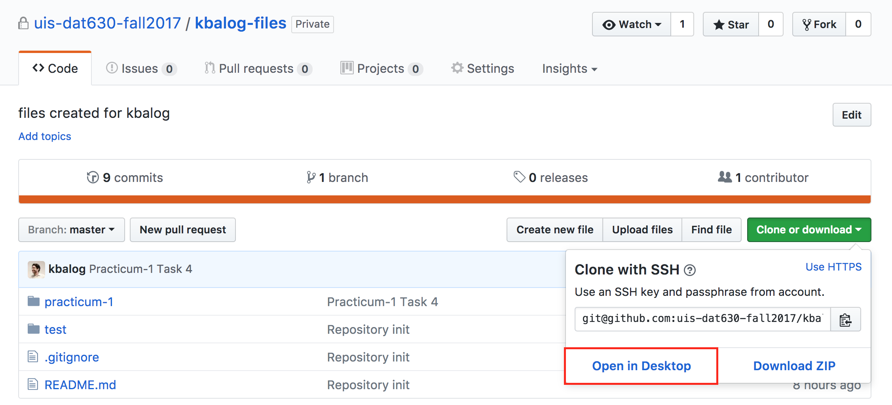
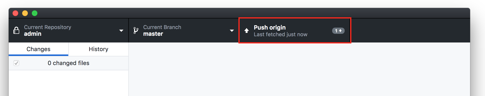
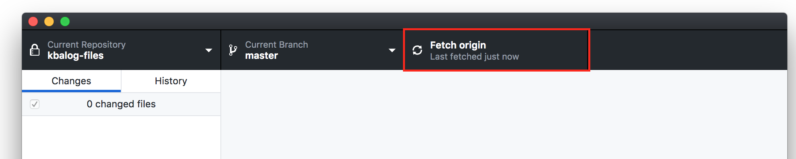

# GitHub usage

There are two repositories for this course: a public and a private one.

## Public repository

The public repository may be found at https://github.com/kbalog/uis-dat630-fall2017. Since you're reading this document, it means you've found it ;)

The public repository contains the course schedule, links to slides, exercises, solutions, assignments, etc.

You may clone this repository, but it is probably easiest to access it via the GitHub web interface.

## Private repository

For each student, a private repository is created, which is available at https://github.com/uis-dat630-fall2017/{username}-files (replace {username} with your GitHub username).

For each practicum and assignment, the starter files will be pushed to this repository. You should clone this repository on your personal computer (to be done only once), and pull the changes before each practicum/assignment. You can also commit and push the changes you make, i.e., use it for backup and version control. (This may come especially handy when you work on the assignments.) See the next section "Working with GitHub".

#### Troubleshooting

If you cannot find your repository there it may be because of one of the following two reasons:

  - You have not filled out (or not in time) the sign-up form. Send us your GitHub username to dat630help@googlegroups.com ASAP!
  - You may need to go to https://github.com/uis-dat630-fall2017 to accept the invitation.

## Working with GitHub

You can use a graphical client. I recommend the official GitHub client (GitHub Desktop), which is available for both Windows and Mac: https://desktop.github.com/.

You can also work from the command line (for geeks). Here is a crash course: http://try.github.io.

Using GitHub Desktop, you need to first clone the repository. On the GitHub web interface, select the "Open in Desktop" option on the "Clone or download" button:

Then, just follow the instructions in GitHub Desktop.

It's important to know the location of this repository on your computer, as you'll need to run `jupyter notebook` from the same directory.

To pull/push changes from/to the server, use the "Push origin" or "Fetch origin" button in the upper right corner:

That's all folks.
